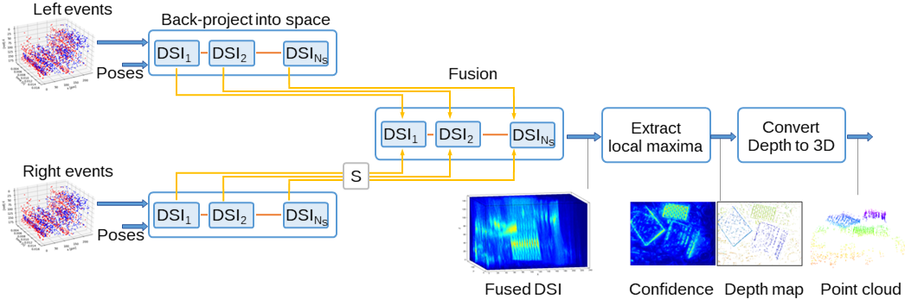

# Multi-Event-Camera Depth Estimation and Outlier Rejection by Refocused Events Fusion

[](https://youtu.be/o7Bxg9XlHmg)

This is the code for the journal paper [**Multi-Event-Camera Depth Estimation and Outlier Rejection by Refocused Events Fusion**](https://doi.org/10.1002/aisy.202200221), by [Suman Ghosh](https://www.linkedin.com/in/suman-ghosh-a8762576/) and [Guillermo Gallego](https://sites.google.com/view/guillermogallego), published at Advanced Intelligent Systems.

The [PDF of the paper is available](https://arxiv.org/abs/2207.10494). If you use this work in your research, please cite it as follows:

```bibtex
@article{Ghosh22aisy,
  author = {Ghosh, Suman and Gallego, Guillermo},  
  title = {Multi-Event-Camera Depth Estimation and Outlier Rejection by Refocused Events Fusion},
  journal = {Advanced Intelligent Systems},
  year = {2022},
  doi = {10.1002/aisy.202200221}
}
```

## Data Processing Pipeline




### Input
* Events from multiple cameras
* Pose of camera rig
* Camera calibration (instrinsic, extrinsic, hand-eye) parameters

### Output
* Depth map
* Confidence map
* Point cloud
* Intermediate ray density maps / Disparity Space Images (DSI)

## Code
* [Installation instructions](docs/installation.md)
* [Running the code with various configurations](docs/running.md)
* [Datasets used](docs/datasets.md)
* [Running Examples](docs/examples.md)


## License

The license is available [here](Software_License_Agreement_TUB_dvs_mcemvs.pdf).

Additional Resources on Event-based Vision
-------
* [Research page (TU Berlin RIP lab)](https://sites.google.com/view/guillermogallego/research/event-based-vision)
* [Course at TU Berlin](https://sites.google.com/view/guillermogallego/teaching/event-based-robot-vision)
* [Survey paper](http://rpg.ifi.uzh.ch/docs/EventVisionSurvey.pdf)
* [List of Resources](https://github.com/uzh-rpg/event-based_vision_resources)
