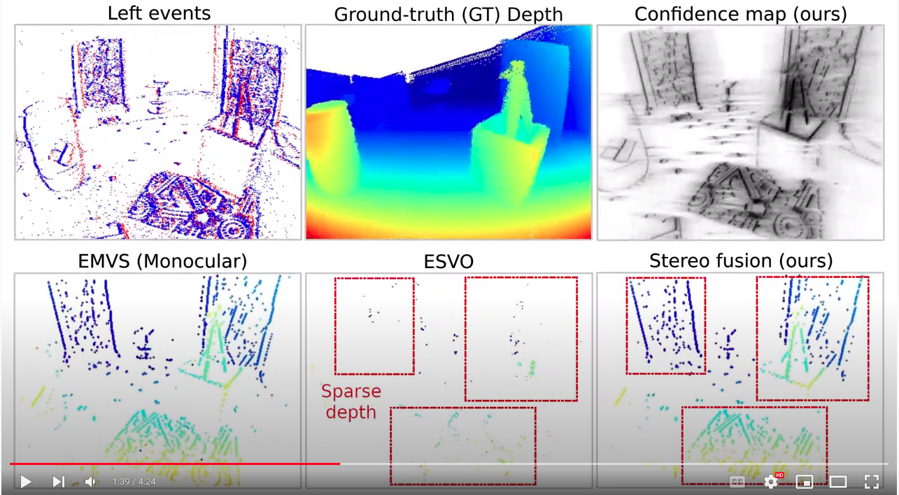

# Multi-Event-Camera Depth Estimation and Outlier Rejection by Refocused Events Fusion

[](https://youtu.be/Ewhkcsu7S4E)
<!--Youtube preview image: https://img.youtube.com/vi/Ewhkcsu7S4E/maxresdefault.jpg-->

This is the repository for [**Multi-Event-Camera Depth Estimation and Outlier Rejection by Refocused Events Fusion**](https://doi.org/10.48550/arXiv.2207.10494) by  
[Suman Ghosh](https://www.linkedin.com/in/suman-ghosh-a8762576/) and [Guillermo Callego](https://sites.google.com/view/guillermogallego).

 <!-- - [Paper]() -->
 - [Video](https://youtu.be/Ewhkcsu7S4E)
 - [PDF](https://doi.org/10.48550/arXiv.2207.10494)
 
 We plan to release the **code** soon.  
If you use this work in your research, please cite it as follows:

```bibtex
@misc{Ghosh22,
  author = {Ghosh, Suman and Gallego, Guillermo},  
  title = {Multi-Event-Camera Depth Estimation and Outlier Rejection by Refocused Events Fusion},
  publisher = {arXiv},
  year = {2022},
  doi = {10.48550/ARXIV.2207.10494}
}
```

## LICENSE

TBD.


Additional Resources on Event-based Vision
-------
* [Research page (TU Berlin RIP lab)](https://sites.google.com/view/guillermogallego/research/event-based-vision)
* [Course at TU Berlin](https://sites.google.com/view/guillermogallego/teaching/event-based-robot-vision)
* [Survey paper](http://rpg.ifi.uzh.ch/docs/EventVisionSurvey.pdf)
* [List of Resources](https://github.com/uzh-rpg/event-based_vision_resources)
